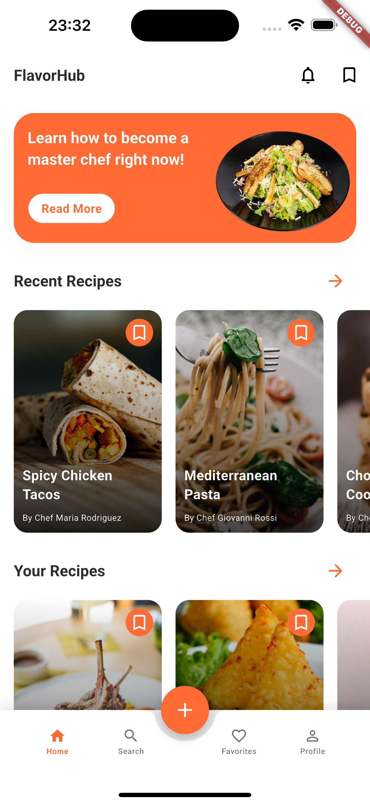

# Flavor Hub 🍳

A Flutter mobile application for sharing and discovering recipes, built with Strapi as the backend CMS. Flavor Hub allows users to browse recipes, view detailed cooking instructions, like recipes, and engage with the community through comments.

## Screenshots

### Home Screen
<div align="center">
  
</div>

*The home screen features a clean interface with recipe discovery, recent recipes, and personalized recommendations from professional chefs.*

## Development Status

- ✅ **User Authentication** - Login/signup with JWT token management
- ✅ **Recipe Browsing** - Browse recipes with images and pagination
- ✅ **Recipe Details** - View comprehensive recipe information
- ✅ **Multi-language Support** - English, French, and Japanese localization
- ✅ **API Integration** - Strapi backend integration with proper error handling
- ✅ **Bottom Navigation** - Modern navigation with floating action button
- ✅ **Profile Management** - User profiles with social media integration
- 🚧 **UI Re-design** - In progress to enhance user experience and visual appeal
- 🚧 **Comment System** - Basic commenting implemented, author population in progress
- 🚧 **Recipe Interactions** - Like functionality implemented, needs refinement
- 🚧 **Freezed Models** - Migrating data models to Freezed for better code generation
- 📋 **Recipe Creation** - Planned for future release
- 📋 **Push Notifications** - Under consideration
- 📋 **Dark Mode** - UI components ready, theme switching implementation planned

### Legend

- ✅ **Completed** - Feature is fully implemented and tested
- 🚧 **In Progress** - Feature is partially implemented or being refined
- 📋 **Planned** - Feature is planned for future development

## Features

### Core Features
- **Recipe Discovery**: Browse a collection of recipes with images and detailed information
- **Recipe Details**: View comprehensive recipe information including ingredients, cooking steps, and descriptions
- **User Authentication**: Secure login and signup functionality with JWT token management
- **Social Features**: Like recipes and leave comments on your favorite dishes (in development)
- **Multi-language Support**: Available in English, French, and Japanese
- **Responsive Design**: Optimized for both iOS and Android platforms

### UI/UX Features
- **Modern Navigation**: Bottom navigation with floating action button for quick recipe creation
- **Hero Animations**: Smooth transitions between screens
- **Profile System**: User profiles with social media links and recipe collections
- **Custom Components**: Reusable UI components with consistent theming
- **Mock Data**: Realistic sample data for development and testing

## Tech Stack

### Frontend
- **Flutter**: Cross-platform mobile development framework
- **Dart**: Programming language
- **Provider**: State management
- **Freezed**: Code generation for data models (in migration)
- **Easy Localization**: Internationalization support
- **HTTP**: API communication
- **Font Awesome Flutter**: Social media icons

### Backend
- **Strapi**: Headless CMS for content management
- **JWT**: Authentication tokens
- **Rich Text (Blocks)**: For recipe descriptions and content

### Development Tools
- **Build Runner**: Code generation
- **JSON Serializable**: Automatic JSON serialization
- **Flutter Dotenv**: Environment variable management

## Project Structure

```
lib/
├── main.dart                    # App entry point and configuration
├── components/
│   └── app_bar.dart            # Reusable app bar component
├── data/
│   └── mock_data.dart          # Mock data for development
├── models/
│   ├── recipe.dart             # Recipe data model
│   ├── comment/                # Comment-related models
│   ├── description/            # Rich text description models
│   └── step/                   # Recipe step models
├── screens/
│   ├── main_navigation_screen.dart  # Bottom navigation wrapper
│   ├── home_screen.dart            # Home screen with recipe discovery
│   ├── recipe_details_screen.dart  # Detailed recipe view
│   ├── profile_screen.dart         # User profile with tabs
│   ├── search_screen.dart          # Recipe search functionality
│   ├── add_recipe_screen.dart      # Recipe creation (planned)
│   ├── favorites_screen.dart       # User's favorite recipes
│   ├── login.dart                  # User authentication
│   ├── signup.dart                 # User registration
│   └── request_recipe.dart         # Recipe request functionality
├── shared/
│   ├── themes/                     # App theming and colors
│   └── widgets/                    # Reusable UI components
└── utils/
    ├── server.dart                 # API service layer
    └── app_strings.dart           # String constants
```

## Setup & Installation

### Prerequisites
- Flutter SDK (>=3.0.0)
- Dart SDK
- iOS Simulator / Android Emulator
- [Strapi backend server](https://github.com/samrasugu/flavor_hub_strapi_cms.git)

### Environment Configuration

1. Create a `.env` file in the root directory:

```env
BASE_URL=http://localhost:1337/api
RECIPE_ENDPOINT=/recipes
COMMENT_ENDPOINT=/comments
```

### Installation Steps

1. Clone the repository:
```bash
git clone https://github.com/samrasugu/flavor_hub.git
cd flavor_hub
```

2. Install dependencies:
```bash
flutter pub get
```

3. Generate code (if using Freezed models):
```bash
dart run build_runner build --delete-conflicting-outputs
```

4. Set up translation assets:
```bash
# Ensure assets/translations/ directory exists with translation files
```

5. Run the application:
```bash
flutter run
```

## API Integration

The app integrates with a Strapi backend providing:

- **Recipes API**: Fetch recipes with localization support
- **Comments API**: Recipe comments with user relations
- **Authentication API**: User login/signup with JWT tokens
- **Media API**: Recipe cover images and media assets

### Key API Endpoints

- `GET /api/recipes?locale={lang}&populate=*` - Fetch recipes
- `GET /api/comments?filters[recipe][id][$eq]={id}&populate=comment_author` - Fetch comments
- `POST /api/auth/local` - User authentication
- `POST /api/auth/local/register` - User registration

## Features in Detail

### Navigation System
- **Bottom Navigation**: Five-tab navigation (Home, Search, Add Recipe, Favorites, Profile)
- **Floating Action Button**: Quick access to recipe creation with orange primary color
- **Page Transitions**: Smooth animations between screens

### Recipe Management
- Browse recipes with cover images from professional chefs
- View detailed recipes with ingredients and cooking steps
- Multi-language recipe content support
- Rich text descriptions with proper formatting
- Mock data featuring diverse international cuisine

### User Interaction
- Like/unlike recipes
- Comment system with user attribution
- User authentication and profile management
- Social media integration in profiles
- Secure JWT token management

### Localization
- Support for English (en), French (fr-FR), and Japanese (ja-JP)
- Dynamic locale switching
- Localized content from Strapi backend

## Platform Support

- ✅ iOS
- ✅ Android
- ❌ Web (excluded -- well, for now)
- ❌ Desktop platforms (excluded -- well, for now)

## Development

### Debug Mode Features
- Comprehensive logging with `kDebugMode` checks
- API request/response debugging
- JSON parsing error handling
- Network error tracking

### State Management
- Provider pattern for state management
- Authentication state persistence
- Recipe data caching and updates

### Code Generation
- Freezed for immutable data models
- JSON serialization with build_runner
- Automatic code generation for boilerplate reduction

## Recent Updates

- **Bottom Navigation**: Implemented modern navigation system with FAB
- **Profile Screen**: Added tabbed profile interface with social media integration
- **Mock Data**: Created realistic sample data with diverse chef names and recipes
- **Freezed Migration**: In progress - converting data models for better code generation
- **UI Components**: Enhanced with consistent theming and spacing

## Contributing

1. Fork the repository
2. Create a feature branch (`git checkout -b feature/amazing-feature`)
3. Commit your changes (`git commit -m 'Add some amazing feature'`)
4. Push to the branch (`git push origin feature/amazing-feature`)
5. Open a Pull Request

### Branch Naming Convention
- `feature/` - New features
- `bugfix/` - Bug fixes
- `refactor/` - Code refactoring
- `docs/` - Documentation updates

## License

This project is licensed under the MIT License - see the LICENSE file for details.

## Support

For support and questions, please open an issue in the GitHub repository.

---

<div align="center">
  <p><em>Built with ❤️ using Flutter and Strapi</em></p>
</div>
